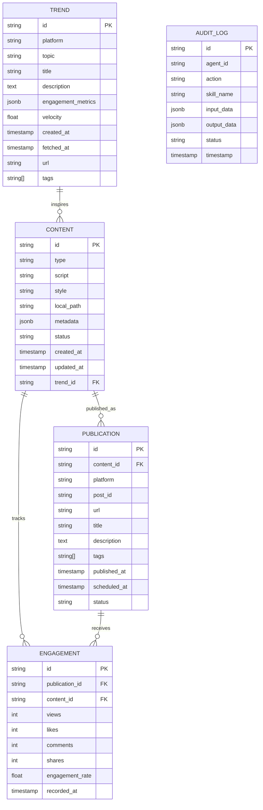

# Project Chimera - Technical Specifications

## API Contracts

### Skill Interface Standard

All skills must implement the following interface:

```python
from typing import Dict, Any, Optional
from pydantic import BaseModel

class SkillInput(BaseModel):
    """Base class for skill inputs"""
    pass

class SkillOutput(BaseModel):
    """Base class for skill outputs"""
    success: bool
    error: Optional[str] = None

async def skill_function(input_data: SkillInput) -> SkillOutput:
    """
    Standard skill function signature.
    
    Args:
        input_data: Validated input model
        
    Returns:
        SkillOutput with success status and results/error
    """
    pass
```

### Trend Fetcher API

**Endpoint**: Internal (Skill-based)  
**Method**: `skill_fetch_trends`

**Input Schema**:
```json
{
  "platforms": ["youtube", "tiktok", "twitter"],
  "categories": ["technology", "entertainment"],
  "time_range": "24h|7d|30d",
  "max_results": 50
}
```

**Output Schema**:
```json
{
  "success": true,
  "trends": [
    {
      "id": "string (unique)",
      "platform": "youtube|tiktok|twitter",
      "topic": "string",
      "title": "string",
      "description": "string",
      "engagement_metrics": {
        "views": 0,
        "likes": 0,
        "comments": 0,
        "shares": 0,
        "engagement_rate": 0.0
      },
      "velocity": 0.0,
      "timestamp": "ISO8601",
      "url": "string",
      "tags": ["string"]
    }
  ],
  "metadata": {
    "total_results": 0,
    "fetch_time": "ISO8601",
    "platforms_queried": ["string"]
  },
  "error": null
}
```

**Pydantic Model**:
```python
from pydantic import BaseModel, Field, HttpUrl
from typing import Literal, Optional, List
from datetime import datetime

class EngagementMetrics(BaseModel):
    views: int = Field(default=0, description="View count")
    likes: int = Field(default=0, description="Like count")
    comments: int = Field(default=0, description="Comment count")
    shares: int = Field(default=0, description="Share count")
    engagement_rate: float = Field(default=0.0, ge=0.0, le=1.0, description="Engagement rate 0-1")

class TrendData(BaseModel):
    id: str = Field(description="Unique trend identifier")
    platform: Literal["youtube", "tiktok", "twitter"] = Field(description="Source platform")
    topic: str = Field(description="Trend topic")
    title: str = Field(description="Trend title")
    description: str = Field(description="Trend description")
    engagement_metrics: EngagementMetrics = Field(description="Engagement metrics")
    velocity: float = Field(description="Trend velocity (growth rate)")
    timestamp: datetime = Field(description="ISO8601 timestamp")
    url: HttpUrl = Field(description="Trend URL")
    tags: List[str] = Field(default_factory=list, description="Trend tags")

class FetchTrendsMetadata(BaseModel):
    total_results: int = Field(description="Total number of trends fetched")
    fetch_time: datetime = Field(description="ISO8601 fetch timestamp")
    platforms_queried: List[str] = Field(description="List of platforms queried")

class FetchTrendsInput(BaseModel):
    platforms: List[Literal["youtube", "tiktok", "twitter"]] = Field(description="Platforms to query")
    categories: List[str] = Field(default_factory=list, description="Optional category filters")
    time_range: Literal["24h", "7d", "30d"] = Field(default="24h", description="Time range for trends")
    max_results: int = Field(default=50, ge=1, le=1000, description="Maximum results per platform")

class FetchTrendsOutput(BaseModel):
    success: bool
    trends: List[TrendData] = Field(default_factory=list, description="List of trend data")
    metadata: Optional[FetchTrendsMetadata] = None
    error: Optional[str] = None
```

### Video Download API

**Endpoint**: Internal (Skill-based)  
**Method**: `skill_download_video`

**Input Schema**:
```json
{
  "source_url": "string (required)",
  "platform": "youtube|tiktok|twitter (required)",
  "quality": "high|medium|low (optional, default: medium)"
}
```

**Output Schema**:
```json
{
  "success": true,
  "local_path": "string (if success)",
  "metadata": {
    "duration": 0.0,
    "resolution": "string",
    "format": "string",
    "file_size": 0,
    "codec": "string"
  },
  "error": null
}
```

**Pydantic Model**:
```python
from pydantic import BaseModel, Field, HttpUrl
from typing import Literal, Optional

class DownloadVideoInput(BaseModel):
    source_url: HttpUrl = Field(description="URL of the video to download")
    platform: Literal["youtube", "tiktok", "twitter"] = Field(description="Source platform")
    quality: Literal["high", "medium", "low"] = Field(default="medium", description="Video quality")

class VideoMetadata(BaseModel):
    duration: float = Field(description="Video duration in seconds")
    resolution: str = Field(description="Video resolution (e.g., '1920x1080')")
    format: str = Field(description="Video format (e.g., 'mp4', 'webm')")
    file_size: int = Field(description="File size in bytes")
    codec: Optional[str] = Field(default=None, description="Video codec")

class DownloadVideoOutput(BaseModel):
    success: bool
    local_path: Optional[str] = Field(default=None, description="Local file path if successful")
    metadata: Optional[VideoMetadata] = Field(default=None)
    error: Optional[str] = Field(default=None, description="Error message if failed")
```

### Transcription API

**Endpoint**: Internal (Skill-based)  
**Method**: `skill_transcribe_audio`

**Input Schema**:
```json
{
  "video_path": "string (required)",
  "language": "string (optional, default: auto-detect)",
  "include_timestamps": true
}
```

**Output Schema**:
```json
{
  "success": true,
  "transcript": "string (full transcript text)",
  "segments": [
    {
      "text": "string",
      "start": 0.0,
      "end": 0.0,
      "confidence": 0.95
    }
  ],
  "language": "en",
  "metadata": {
    "duration": 0.0,
    "word_count": 0,
    "speaker_count": 1
  },
  "error": null
}
```

**Pydantic Model**:
```python
from pydantic import BaseModel, Field
from typing import Optional, List

class TranscriptSegment(BaseModel):
    text: str = Field(description="Segment text")
    start: float = Field(description="Start time in seconds")
    end: float = Field(description="End time in seconds")
    confidence: float = Field(ge=0.0, le=1.0, description="Confidence score 0-1")

class TranscriptionMetadata(BaseModel):
    duration: float = Field(description="Audio duration in seconds")
    word_count: int = Field(description="Total word count")
    speaker_count: int = Field(default=1, description="Number of speakers detected")

class TranscribeAudioInput(BaseModel):
    video_path: str = Field(description="Path to video file")
    language: Optional[str] = Field(default=None, description="Language code (ISO 639-1) or 'auto'")
    include_timestamps: bool = Field(default=True, description="Include timestamp segments")

class TranscribeAudioOutput(BaseModel):
    success: bool
    transcript: Optional[str] = Field(default=None, description="Full transcript text")
    segments: List[TranscriptSegment] = Field(default_factory=list)
    language: str = Field(description="Detected language code")
    metadata: Optional[TranscriptionMetadata] = None
    error: Optional[str] = None
```

### Video Generation API

**Endpoint**: Internal (Skill-based)  
**Method**: `skill_generate_video`

**Input Schema**:
```json
{
  "script": "string (required)",
  "style": "string (required)",
  "duration": 60.0,
  "platform": "youtube|tiktok|instagram",
  "assets": {
    "images": ["/path/to/image1.jpg"],
    "audio": "/path/to/audio.mp3"
  }
}
```

**Output Schema**:
```json
{
  "success": true,
  "video_path": "string (if success)",
  "metadata": {
    "duration": 60.0,
    "resolution": "1920x1080",
    "file_size": 0,
    "format": "mp4",
    "fps": 30
  },
  "error": null
}
```

**Pydantic Model**:
```python
from pydantic import BaseModel, Field
from typing import Literal, Optional, List

class VideoAssets(BaseModel):
    images: List[str] = Field(default_factory=list, description="Paths to image assets")
    audio: Optional[str] = Field(default=None, description="Path to audio file")

class GenerateVideoInput(BaseModel):
    script: str = Field(description="Video script/narrative")
    style: str = Field(description="Visual style (e.g., 'modern', 'vintage', 'minimalist')")
    duration: Optional[float] = Field(default=None, description="Target duration in seconds")
    platform: Literal["youtube", "tiktok", "instagram"] = Field(description="Target platform")
    assets: VideoAssets = Field(default_factory=VideoAssets)

class GeneratedVideoMetadata(BaseModel):
    duration: float = Field(description="Actual duration in seconds")
    resolution: str = Field(description="Video resolution")
    file_size: int = Field(description="File size in bytes")
    format: str = Field(description="Video format")
    fps: int = Field(description="Frames per second")

class GenerateVideoOutput(BaseModel):
    success: bool
    video_path: Optional[str] = Field(default=None, description="Path to generated video")
    metadata: Optional[GeneratedVideoMetadata] = None
    error: Optional[str] = None
```

### Content Publishing API

**Endpoint**: Internal (Skill-based)  
**Method**: `skill_publish_content`

**Input Schema**:
```json
{
  "content_path": "string (required)",
  "platform": "youtube|tiktok|instagram|twitter",
  "title": "string (required)",
  "description": "string (optional)",
  "tags": ["tag1", "tag2"],
  "schedule_time": "2025-02-04T12:00:00Z"
}
```

**Output Schema**:
```json
{
  "success": true,
  "post_id": "string (platform-specific ID)",
  "url": "https://platform.com/post/123",
  "published_at": "2025-02-04T12:00:00Z",
  "metadata": {
    "platform": "youtube",
    "status": "published|scheduled"
  },
  "error": null
}
```

**Pydantic Model**:
```python
from pydantic import BaseModel, Field
from typing import Literal, Optional, List
from datetime import datetime

class PublishContentInput(BaseModel):
    content_path: str = Field(description="Path to content file")
    platform: Literal["youtube", "tiktok", "instagram", "twitter"] = Field(description="Target platform")
    title: str = Field(description="Content title")
    description: Optional[str] = Field(default=None, description="Content description")
    tags: List[str] = Field(default_factory=list, description="Content tags")
    schedule_time: Optional[datetime] = Field(default=None, description="ISO8601 datetime for scheduling")

class PublicationMetadata(BaseModel):
    platform: str = Field(description="Platform name")
    status: Literal["published", "scheduled", "failed"] = Field(description="Publication status")

class PublishContentOutput(BaseModel):
    success: bool
    post_id: Optional[str] = Field(default=None, description="Platform-specific post ID")
    url: Optional[str] = Field(default=None, description="Published content URL")
    published_at: Optional[datetime] = Field(default=None, description="ISO8601 datetime")
    metadata: Optional[PublicationMetadata] = None
    error: Optional[str] = None
```

## Executable Specifications: Pydantic Models

All API contracts are defined using Pydantic v2 models for type safety and validation. These models can be directly imported and used in implementation.

### Complete Model Reference

```python
# Base Models (from skills/base.py)
from pydantic import BaseModel, Field
from typing import Optional

class SkillInput(BaseModel):
    """Base class for all skill inputs"""
    pass

class SkillOutput(BaseModel):
    """Base class for all skill outputs"""
    success: bool = Field(description="Whether the skill execution was successful")
    error: Optional[str] = Field(default=None, description="Error message if success is False")

# All skill-specific models are defined in their respective API sections above.
# Import pattern:
# from specs.technical import FetchTrendsInput, FetchTrendsOutput
# from specs.technical import DownloadVideoInput, DownloadVideoOutput
# etc.
```

### Usage Example

```python
from pydantic import ValidationError
from specs.technical import FetchTrendsInput, FetchTrendsOutput

# Input validation
try:
    input_data = FetchTrendsInput(
        platforms=["youtube", "tiktok"],
        time_range="24h",
        max_results=50
    )
except ValidationError as e:
    # Handle validation errors
    print(e.json())

# Output creation
output = FetchTrendsOutput(
    success=True,
    trends=[...],
    metadata=FetchTrendsMetadata(...)
)
```

### Model Validation Rules

1. **Required Fields**: All fields without `Optional` or default values are required
2. **Type Validation**: Pydantic automatically validates types (str, int, float, etc.)
3. **Enum Validation**: `Literal` types enforce enum-like constraints
4. **Range Validation**: Use `ge` (>=), `le` (<=) for numeric constraints
5. **URL Validation**: Use `HttpUrl` for URL fields
6. **DateTime Validation**: Use `datetime` for ISO8601 timestamps

### OpenClaw Announce API

**Endpoint**: Internal (Skill-based)  
**Method**: `skill_openclaw_announce`

**Input Schema**:
```json
{
  "agent_id": "chimera-research-001",
  "capabilities": [
    {
      "skill_name": "skill_fetch_trends",
      "description": "Fetches trending topics from social platforms",
      "rate_limit": "100/hour"
    }
  ],
  "status": "available|busy|offline"
}
```

**Output Schema**:
```json
{
  "success": true,
  "announcement_id": "uuid",
  "timestamp": "ISO8601",
  "metadata": {
    "network": "openclaw",
    "version": "1.0"
  },
  "error": null
}
```

**Pydantic Model**:
```python
from pydantic import BaseModel, Field
from typing import Literal, Optional, List
from datetime import datetime

class Capability(BaseModel):
    skill_name: str = Field(description="Skill identifier")
    description: str = Field(description="Skill description")
    rate_limit: Optional[str] = Field(default=None, description="Rate limit (e.g., '100/hour')")

class OpenClawAnnounceInput(BaseModel):
    agent_id: str = Field(description="Unique agent identifier")
    capabilities: List[Capability] = Field(description="List of agent capabilities")
    status: Literal["available", "busy", "offline"] = Field(description="Agent status")

class OpenClawAnnounceMetadata(BaseModel):
    network: str = Field(default="openclaw", description="Network identifier")
    version: str = Field(default="1.0", description="Protocol version")

class OpenClawAnnounceOutput(BaseModel):
    success: bool
    announcement_id: Optional[str] = Field(default=None, description="Announcement identifier")
    timestamp: datetime = Field(description="ISO8601 timestamp")
    metadata: Optional[OpenClawAnnounceMetadata] = None
    error: Optional[str] = None
```

## Database Schema

### Entity Relationship Diagram



### Database Choice: PostgreSQL

**Rationale**:
- **Structured data**: Trends, content, publications have well-defined schemas
- **JSONB support**: Flexible storage for metadata and engagement metrics
- **ACID compliance**: Critical for audit logs and transaction integrity
- **Scalability**: Proven at scale with proper indexing
- **MCP integration**: PostgreSQL MCP servers readily available

### Table Definitions

#### `trends`
```sql
CREATE TABLE trends (
    id VARCHAR(255) PRIMARY KEY,
    platform VARCHAR(50) NOT NULL,
    topic VARCHAR(255) NOT NULL,
    title TEXT NOT NULL,
    description TEXT,
    engagement_metrics JSONB NOT NULL,
    velocity FLOAT NOT NULL,
    created_at TIMESTAMP WITH TIME ZONE DEFAULT NOW(),
    fetched_at TIMESTAMP WITH TIME ZONE NOT NULL,
    url TEXT NOT NULL,
    tags TEXT[],
    INDEX idx_platform_fetched (platform, fetched_at),
    INDEX idx_velocity (velocity DESC),
    INDEX idx_topic (topic)
);
```

#### `content`
```sql
CREATE TABLE content (
    id VARCHAR(255) PRIMARY KEY,
    type VARCHAR(50) NOT NULL, -- 'video', 'image', 'text'
    script TEXT,
    style VARCHAR(100),
    local_path TEXT,
    metadata JSONB,
    status VARCHAR(50) NOT NULL, -- 'draft', 'generating', 'ready', 'published', 'failed'
    created_at TIMESTAMP WITH TIME ZONE DEFAULT NOW(),
    updated_at TIMESTAMP WITH TIME ZONE DEFAULT NOW(),
    trend_id VARCHAR(255) REFERENCES trends(id),
    INDEX idx_status (status),
    INDEX idx_trend_id (trend_id),
    INDEX idx_created_at (created_at DESC)
);
```

#### `publications`
```sql
CREATE TABLE publications (
    id VARCHAR(255) PRIMARY KEY,
    content_id VARCHAR(255) NOT NULL REFERENCES content(id),
    platform VARCHAR(50) NOT NULL,
    post_id VARCHAR(255),
    url TEXT,
    title TEXT NOT NULL,
    description TEXT,
    tags TEXT[],
    published_at TIMESTAMP WITH TIME ZONE,
    scheduled_at TIMESTAMP WITH TIME ZONE,
    status VARCHAR(50) NOT NULL, -- 'scheduled', 'published', 'failed'
    INDEX idx_platform_status (platform, status),
    INDEX idx_content_id (content_id),
    INDEX idx_published_at (published_at DESC)
);
```

#### `engagement`
```sql
CREATE TABLE engagement (
    id VARCHAR(255) PRIMARY KEY,
    publication_id VARCHAR(255) REFERENCES publications(id),
    content_id VARCHAR(255) REFERENCES content(id),
    views INT DEFAULT 0,
    likes INT DEFAULT 0,
    comments INT DEFAULT 0,
    shares INT DEFAULT 0,
    engagement_rate FLOAT,
    recorded_at TIMESTAMP WITH TIME ZONE DEFAULT NOW(),
    INDEX idx_publication_id (publication_id),
    INDEX idx_recorded_at (recorded_at DESC)
);
```

#### `audit_logs`
```sql
CREATE TABLE audit_logs (
    id VARCHAR(255) PRIMARY KEY,
    agent_id VARCHAR(255) NOT NULL,
    action VARCHAR(100) NOT NULL,
    skill_name VARCHAR(100),
    input_data JSONB,
    output_data JSONB,
    status VARCHAR(50) NOT NULL, -- 'success', 'failure', 'pending'
    timestamp TIMESTAMP WITH TIME ZONE DEFAULT NOW(),
    INDEX idx_agent_id (agent_id),
    INDEX idx_timestamp (timestamp DESC),
    INDEX idx_skill_name (skill_name)
);
```

## Agent Architecture Pattern

### Hierarchical Swarm Pattern

**Selected Pattern**: Hierarchical Swarm with Specialized Agents

**Rationale**:
- **Separation of concerns**: Research, Generation, Publishing are distinct domains
- **Scalability**: Agents can be scaled independently
- **Fault isolation**: Failure in one agent doesn't cascade
- **Skill reuse**: Skills can be shared across agents

**Architecture**:
```
┌─────────────────────────────────────────┐
│         Orchestrator Agent              │
│     (Coordinates workflow)              │
└──────────────┬──────────────────────────┘
               │
    ┌──────────┼──────────┐
    │          │          │
┌───▼───┐  ┌───▼───┐  ┌───▼───┐
│Research│  │Generate│  │Publish│
│ Agent  │  │ Agent  │  │ Agent │
└───┬───┘  └───┬───┘  └───┬───┘
    │          │          │
    └──────────┼──────────┘
               │
    ┌──────────▼──────────┐
    │   Skills Layer      │
    │  (Shared functions)  │
    └─────────────────────┘
```

## Technology Stack

### Core
- **Language**: Python 3.11+
- **Framework**: AsyncIO for concurrent operations
- **Validation**: Pydantic v2 for data validation
- **HTTP Client**: httpx for async HTTP requests

### Database
- **Primary**: PostgreSQL 15+
- **ORM/Query**: SQLAlchemy 2.0 (async) or raw SQL with asyncpg
- **Migrations**: Alembic

### MCP Integration
- **MCP Client**: Official MCP Python SDK
- **MCP Servers**: 
  - PostgreSQL MCP (database operations)
  - Filesystem MCP (file operations)
  - Git MCP (version control)
  - Custom MCP servers for social platforms

### Testing
- **Framework**: pytest with pytest-asyncio
- **Coverage**: pytest-cov
- **Mocking**: pytest-mock, respx (for HTTP mocking)

### Infrastructure
- **Containerization**: Docker
- **CI/CD**: GitHub Actions
- **Code Quality**: ruff, black, mypy
- **AI Review**: CodeRabbit (or similar)

## Error Handling

### Error Categories

1. **Transient Errors**: Network timeouts, rate limits
   - **Action**: Retry with exponential backoff
   - **Max Retries**: 3
   
2. **Validation Errors**: Invalid input data
   - **Action**: Return error immediately, no retry
   
3. **Permanent Errors**: Authentication failures, invalid credentials
   - **Action**: Log error, alert human operator
   
4. **Unknown Errors**: Unexpected exceptions
   - **Action**: Log full stack trace, alert human operator

### Error Response Format

```json
{
  "success": false,
  "error": {
    "code": "ERROR_CODE",
    "message": "Human-readable message",
    "details": {},
    "timestamp": "ISO8601",
    "retryable": true
  }
}
```

## Security Specifications

### Authentication
- All external API calls use OAuth 2.0 or API keys
- Credentials stored in environment variables only
- Never commit secrets to repository

### Data Privacy
- User data encrypted at rest
- PII redacted from audit logs
- Content stored with access controls

### Rate Limiting
- Respect platform rate limits
- Implement internal rate limiting to prevent abuse
- Queue requests when rate limit exceeded

---

**Status**: ✅ Draft Complete  
**Last Updated**: 2025-02-04  
**Author**: Weldeyohans Nigus
