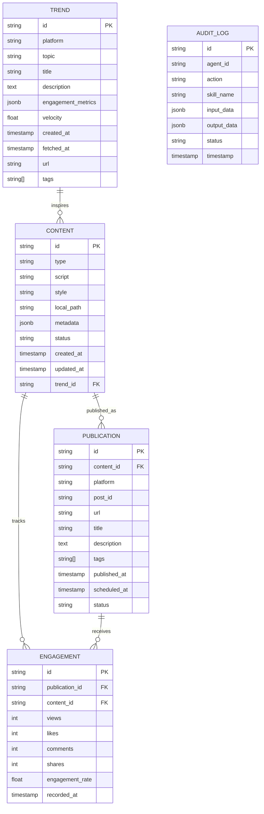

# Project Chimera - Technical Specifications

## API Contracts

### Skill Interface Standard

All skills must implement the following interface:

```python
from typing import Dict, Any, Optional
from pydantic import BaseModel

class SkillInput(BaseModel):
    """Base class for skill inputs"""
    pass

class SkillOutput(BaseModel):
    """Base class for skill outputs"""
    success: bool
    error: Optional[str] = None

async def skill_function(input_data: SkillInput) -> SkillOutput:
    """
    Standard skill function signature.
    
    Args:
        input_data: Validated input model
        
    Returns:
        SkillOutput with success status and results/error
    """
    pass
```

### Trend Fetcher API

**Endpoint**: Internal (Skill-based)  
**Method**: `skill_fetch_trends`

**Input Schema**:
```json
{
  "platforms": ["youtube", "tiktok", "twitter"],
  "categories": ["technology", "entertainment"],
  "time_range": "24h|7d|30d",
  "max_results": 50
}
```

**Output Schema**:
```json
{
  "success": true,
  "trends": [
    {
      "id": "string (unique)",
      "platform": "youtube|tiktok|twitter",
      "topic": "string",
      "title": "string",
      "description": "string",
      "engagement_metrics": {
        "views": 0,
        "likes": 0,
        "comments": 0,
        "shares": 0,
        "engagement_rate": 0.0
      },
      "velocity": 0.0,
      "timestamp": "ISO8601",
      "url": "string",
      "tags": ["string"]
    }
  ],
  "metadata": {
    "total_results": 0,
    "fetch_time": "ISO8601",
    "platforms_queried": ["string"]
  },
  "error": null
}
```

### Video Download API

**Endpoint**: Internal (Skill-based)  
**Method**: `skill_download_video`

**Input Schema**: (See `functional.md` Story 2.1)

**Output Schema**: (See `functional.md` Story 2.1)

### Transcription API

**Endpoint**: Internal (Skill-based)  
**Method**: `skill_transcribe_audio`

**Input Schema**: (See `functional.md` Story 2.2)

**Output Schema**: (See `functional.md` Story 2.2)

### Video Generation API

**Endpoint**: Internal (Skill-based)  
**Method**: `skill_generate_video`

**Input Schema**: (See `functional.md` Story 2.3)

**Output Schema**: (See `functional.md` Story 2.3)

### Content Publishing API

**Endpoint**: Internal (Skill-based)  
**Method**: `skill_publish_content`

**Input Schema**: (See `functional.md` Story 3.1)

**Output Schema**: (See `functional.md` Story 3.1)

## Database Schema

### Entity Relationship Diagram



### Database Choice: PostgreSQL

**Rationale**:
- **Structured data**: Trends, content, publications have well-defined schemas
- **JSONB support**: Flexible storage for metadata and engagement metrics
- **ACID compliance**: Critical for audit logs and transaction integrity
- **Scalability**: Proven at scale with proper indexing
- **MCP integration**: PostgreSQL MCP servers readily available

### Table Definitions

#### `trends`
```sql
CREATE TABLE trends (
    id VARCHAR(255) PRIMARY KEY,
    platform VARCHAR(50) NOT NULL,
    topic VARCHAR(255) NOT NULL,
    title TEXT NOT NULL,
    description TEXT,
    engagement_metrics JSONB NOT NULL,
    velocity FLOAT NOT NULL,
    created_at TIMESTAMP WITH TIME ZONE DEFAULT NOW(),
    fetched_at TIMESTAMP WITH TIME ZONE NOT NULL,
    url TEXT NOT NULL,
    tags TEXT[],
    INDEX idx_platform_fetched (platform, fetched_at),
    INDEX idx_velocity (velocity DESC),
    INDEX idx_topic (topic)
);
```

#### `content`
```sql
CREATE TABLE content (
    id VARCHAR(255) PRIMARY KEY,
    type VARCHAR(50) NOT NULL, -- 'video', 'image', 'text'
    script TEXT,
    style VARCHAR(100),
    local_path TEXT,
    metadata JSONB,
    status VARCHAR(50) NOT NULL, -- 'draft', 'generating', 'ready', 'published', 'failed'
    created_at TIMESTAMP WITH TIME ZONE DEFAULT NOW(),
    updated_at TIMESTAMP WITH TIME ZONE DEFAULT NOW(),
    trend_id VARCHAR(255) REFERENCES trends(id),
    INDEX idx_status (status),
    INDEX idx_trend_id (trend_id),
    INDEX idx_created_at (created_at DESC)
);
```

#### `publications`
```sql
CREATE TABLE publications (
    id VARCHAR(255) PRIMARY KEY,
    content_id VARCHAR(255) NOT NULL REFERENCES content(id),
    platform VARCHAR(50) NOT NULL,
    post_id VARCHAR(255),
    url TEXT,
    title TEXT NOT NULL,
    description TEXT,
    tags TEXT[],
    published_at TIMESTAMP WITH TIME ZONE,
    scheduled_at TIMESTAMP WITH TIME ZONE,
    status VARCHAR(50) NOT NULL, -- 'scheduled', 'published', 'failed'
    INDEX idx_platform_status (platform, status),
    INDEX idx_content_id (content_id),
    INDEX idx_published_at (published_at DESC)
);
```

#### `engagement`
```sql
CREATE TABLE engagement (
    id VARCHAR(255) PRIMARY KEY,
    publication_id VARCHAR(255) REFERENCES publications(id),
    content_id VARCHAR(255) REFERENCES content(id),
    views INT DEFAULT 0,
    likes INT DEFAULT 0,
    comments INT DEFAULT 0,
    shares INT DEFAULT 0,
    engagement_rate FLOAT,
    recorded_at TIMESTAMP WITH TIME ZONE DEFAULT NOW(),
    INDEX idx_publication_id (publication_id),
    INDEX idx_recorded_at (recorded_at DESC)
);
```

#### `audit_logs`
```sql
CREATE TABLE audit_logs (
    id VARCHAR(255) PRIMARY KEY,
    agent_id VARCHAR(255) NOT NULL,
    action VARCHAR(100) NOT NULL,
    skill_name VARCHAR(100),
    input_data JSONB,
    output_data JSONB,
    status VARCHAR(50) NOT NULL, -- 'success', 'failure', 'pending'
    timestamp TIMESTAMP WITH TIME ZONE DEFAULT NOW(),
    INDEX idx_agent_id (agent_id),
    INDEX idx_timestamp (timestamp DESC),
    INDEX idx_skill_name (skill_name)
);
```

## Agent Architecture Pattern

### Hierarchical Swarm Pattern

**Selected Pattern**: Hierarchical Swarm with Specialized Agents

**Rationale**:
- **Separation of concerns**: Research, Generation, Publishing are distinct domains
- **Scalability**: Agents can be scaled independently
- **Fault isolation**: Failure in one agent doesn't cascade
- **Skill reuse**: Skills can be shared across agents

**Architecture**:
```
┌─────────────────────────────────────────┐
│         Orchestrator Agent              │
│     (Coordinates workflow)              │
└──────────────┬──────────────────────────┘
               │
    ┌──────────┼──────────┐
    │          │          │
┌───▼───┐  ┌───▼───┐  ┌───▼───┐
│Research│  │Generate│  │Publish│
│ Agent  │  │ Agent  │  │ Agent │
└───┬───┘  └───┬───┘  └───┬───┘
    │          │          │
    └──────────┼──────────┘
               │
    ┌──────────▼──────────┐
    │   Skills Layer      │
    │  (Shared functions)  │
    └─────────────────────┘
```

## Technology Stack

### Core
- **Language**: Python 3.11+
- **Framework**: AsyncIO for concurrent operations
- **Validation**: Pydantic v2 for data validation
- **HTTP Client**: httpx for async HTTP requests

### Database
- **Primary**: PostgreSQL 15+
- **ORM/Query**: SQLAlchemy 2.0 (async) or raw SQL with asyncpg
- **Migrations**: Alembic

### MCP Integration
- **MCP Client**: Official MCP Python SDK
- **MCP Servers**: 
  - PostgreSQL MCP (database operations)
  - Filesystem MCP (file operations)
  - Git MCP (version control)
  - Custom MCP servers for social platforms

### Testing
- **Framework**: pytest with pytest-asyncio
- **Coverage**: pytest-cov
- **Mocking**: pytest-mock, respx (for HTTP mocking)

### Infrastructure
- **Containerization**: Docker
- **CI/CD**: GitHub Actions
- **Code Quality**: ruff, black, mypy
- **AI Review**: CodeRabbit (or similar)

## Error Handling

### Error Categories

1. **Transient Errors**: Network timeouts, rate limits
   - **Action**: Retry with exponential backoff
   - **Max Retries**: 3
   
2. **Validation Errors**: Invalid input data
   - **Action**: Return error immediately, no retry
   
3. **Permanent Errors**: Authentication failures, invalid credentials
   - **Action**: Log error, alert human operator
   
4. **Unknown Errors**: Unexpected exceptions
   - **Action**: Log full stack trace, alert human operator

### Error Response Format

```json
{
  "success": false,
  "error": {
    "code": "ERROR_CODE",
    "message": "Human-readable message",
    "details": {},
    "timestamp": "ISO8601",
    "retryable": true
  }
}
```

## Security Specifications

### Authentication
- All external API calls use OAuth 2.0 or API keys
- Credentials stored in environment variables only
- Never commit secrets to repository

### Data Privacy
- User data encrypted at rest
- PII redacted from audit logs
- Content stored with access controls

### Rate Limiting
- Respect platform rate limits
- Implement internal rate limiting to prevent abuse
- Queue requests when rate limit exceeded

---

**Status**: ✅ Draft Complete  
**Last Updated**: 2025-02-04  
**Author**: Weldeyohans Nigus
